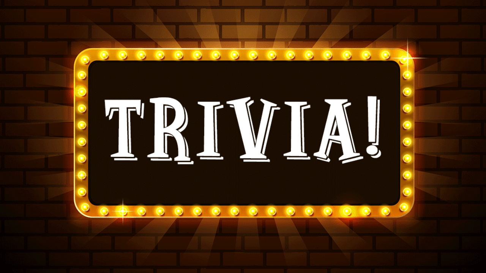

# 🎮 Mini-Game-Hub 🎮

A collection of fun and interactive mini-games built with **HTML, CSS, and JavaScript**. Play classic games like **Hangman, Guess the Number, Guess the Word, and Trivia Quiz**—all in one place!

---

## 🚀 **Live Demo**

🔗 [Click Here to Play Mini-Game-Hub](#)

---

## 🎯 **About the Project**

**Mini-Game-Hub** is a simple yet engaging platform that offers multiple browser-based games. Whether you enjoy word games, number challenges, or trivia quizzes, there's something for everyone!

### ✨ **Key Features**

✅ **Dark & Futuristic UI** 🌑  
✅ **Multiple Games in One Platform** 🎲  
✅ **Interactive & Engaging Gameplay** 🎮  
✅ **Fully Responsive Design** 📱  
✅ **Easy Navigation Between Games** 🔄

---

## 🛠 **Technologies Used**

| Technology     | Purpose                    |
| -------------- | -------------------------- |
| **HTML**       | Structure of the Webpage   |
| **CSS**        | Styling & UI Enhancements  |
| **JavaScript** | Game Logic & Interactivity |

---

## 🎮 **Available Games**

Here’s a quick look at the games available in **Mini-Game-Hub**:

| 🕹 Game                                            | 🎯 Description                                                          | ▶ Play Now   |
| ------------------------------------------------- | ----------------------------------------------------------------------- | ------------ |
|         | **Hangman** - Test your word-guessing skills with this classic game.    | [🔗 Play](#) |
|  | **Guess the Number** - Can you guess the right number? Test your luck!  | [🔗 Play](#) |
|    | **Guess the Word** - Find the hidden word and challenge yourself.       | [🔗 Play](#) |
|      | **Trivia Quiz** - Answer trivia questions and challenge your knowledge. | [🔗 Play](#) |

---

## 🔧 **How to Run the Project Locally**

Follow these steps to run the project on your local machine:

1️⃣ Clone this repository:

```bash
git clone https://github.com/yourusername/Mini-Game-Hub.git
```
